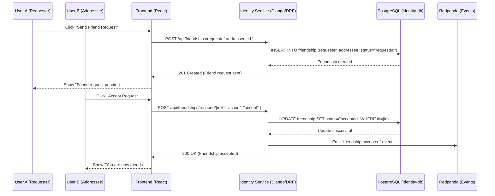

### “In our CMS microservice project, we containerized PostgreSQL with Docker and connected it to a Django identity service. The frontend React microservice communicated with the Django backend over REST APIs secured with JWT. This separation allowed us to test, scale, and deploy services independently.”

## 🔑 Authentication


JWT Authentication is handled via **SimpleJWT**.

- `POST /api/auth/register/` → Register and auto-login  
- `POST /api/auth/login/` → Obtain JWT  
- `POST /api/auth/refresh/` → Refresh JWT  

---

## 👤 Profile Endpoints

- `GET /api/profiles/me/` → Fetch own profile  
- `PUT /api/profiles/me/` → Update profile  

---

## 👫 Friendship Endpoints

- `POST /api/friendships/request/` → Send a new friend request  
- `GET /api/friendships/` → List all friendships and requests (sent + received)  
- `GET /api/friendships/received/` → List friend requests you have received  
- `POST /api/friendships/respond/{id}/` → Respond to a friend request  

---

## 👥 User Endpoints

- `GET /api/users/` → List all users (for friend searching)  

---

## 📜 API Documentation

Swagger & ReDoc are enabled:

- **Swagger UI** → [http://localhost:8000/swagger/](http://localhost:8000/swagger/)  
- **ReDoc** → [http://localhost:8000/redoc/](http://localhost:8000/redoc/)  


## 📈 Sequence Diagram – Friend Request Flow



## 📊 Architecture Diagram


          ┌──────────────┐
          │   Frontend   │
          └──────┬───────┘
                 │
        ┌────────▼────────┐
        │ Identity Service │ (Django + DRF + JWT)
        └───────┬─────────┘
                │
    ┌───────────┼─────────────┐
    │           │             │
┌───▼───┐   ┌───▼────┐   ┌────▼────┐
│Profile│   │Friend- │   │Auth/JWT │
│ Model │   │ ship   │   │   API   │
└───┬───┘   │ Model  │   └────┬────┘
    │       └───┬────┘        │
    │           │             │
    ▼           ▼             ▼
 PostgreSQL   PostgreSQL   Redis/MinIO/Redpanda
 (identity)   (relations)   (future events/storage)


# 📚 Microservices Communication in Our CMS Project

## 🔹 How Microservices Talk to Each Other

Microservices typically communicate through APIs or messaging systems:

### ✅ Synchronous Communication (Request-Response)
- Uses **REST APIs** or **gRPC**, where one service directly calls another.  
- Example: A frontend microservice calling the backend **Identity Service** for authentication.

### ✅ Asynchronous Communication (Event-Driven)
- Uses **message brokers** such as RabbitMQ, Kafka, or AWS SQS.  
- One service **publishes an event**, and others **subscribe and react** without direct coupling.

### ✅ Service Discovery & Load Balancing
- Tools like **Kubernetes**, **Consul**, or **Eureka** are often used so services can find each other dynamically.  


## 🔹 Example From This Project

We built a **microservice-based Content Management System (CMS)** for an educational institution:

### 🛂 Identity Service (Django + DRF)
- Handles **user registration**, **OTP verification**, and **JWT-based login**.  

### 🎨 Frontend Microservice (React)
- Consumes the **Identity Service APIs** to:
  - Register/Login users  
  - Display profile data  

### 🗄️ Database Microservice (PostgreSQL)
- Instead of hardcoding DB connections, we:
  - **Containerized PostgreSQL** as a Docker image  
  - Integrated it with Django via `settings.py`  
  - Used **environment variables** for host, port, username, and password  


## 🚀 Tech Stack
- **Backend:** Django REST Framework  
- **Frontend:** React  
- **Database:** PostgreSQL (Dockerized)  
- **Auth:** JWT + OTP  
- **Deployment:** Docker Compose  


# 🔐 Securing API Endpoints

This document outlines several ways to secure API endpoints in a microservice-based CMS project.

---

## 1️⃣ CORS (Cross-Origin Resource Sharing)

Restrict allowed origins in your **Django settings** so that only your React app domain can make requests.

**In `settings.py`:**

```python
CORS_ALLOWED_ORIGINS = [
    "https://your-react-frontend.com",  # Production React app domain
    "http://localhost:3000",            # Local React dev server
]

```
# 🔑 Securing API Endpoints in Django + React Microservices

This guide covers multiple strategies to secure API endpoints when building microservices with **Django (Identity Service)** and **React (Frontend)**.

---

## 1️⃣ CORS (Cross-Origin Resource Sharing)

Restrict allowed origins in your Django settings so that **only your React app domain** can make requests.

**Django settings.py**
```python
CORS_ALLOWED_ORIGINS = [
    "https://your-react-frontend.com",  # Production React app domain
    "http://localhost:3000",            # Local React dev server
]
```

# 🔐 Securing API Endpoints Between Microservices

This document outlines different ways to **secure API endpoints** when building microservices with **Django (Identity Service)** and **React (Frontend)**.

---

## 2️⃣ API Keys Between Services

Assign an **API key** that only the frontend microservice knows.

**Example in Django**
```python
from django.http import JsonResponse
from django.conf import settings

def api_key_required(view_func):
    def wrapper(request, *args, **kwargs):
        api_key = request.headers.get("X-API-KEY")
        if api_key != settings.FRONTEND_API_KEY:
            return JsonResponse({"error": "Unauthorized"}, status=401)
        return view_func(request, *args, **kwargs)
    return wrapper
```


# 🔐 Securing API Endpoints

---

## 🔑 Store API Keys Securely
Store `FRONTEND_API_KEY` securely in the **React build environment**, not in code.

---

## 3️⃣ JWT with Audience Claim

Issue JWT tokens with a specific `aud` (audience) claim that identifies your React app.

### Example JWT Claim
```json
{
  "sub": "user123",
  "aud": "react-frontend"
}
```

# 🔐 Securing API Endpoints (Advanced)

---

## 4️⃣ mTLS (Mutual TLS, Service-to-Service)

Use **Mutual TLS** for stronger service-to-service authentication.

- Require the **frontend microservice (proxy)** to authenticate with a **client certificate** before calling the Identity Service.  
- Works best if React calls via a **backend proxy** (e.g., Node.js, Nginx) instead of directly.  

---

## 5️⃣ API Gateway Approach

Use an **API Gateway** (e.g., Kong, Nginx, AWS API Gateway):

## 5️⃣ API Gateway Approach

Use an **API Gateway** (e.g., Kong, Nginx, AWS API Gateway):


- Only the **gateway’s internal IP** can reach Django.  

### Benefits
- Centralized authentication  
- Rate limiting  
- Logging & monitoring  
- Enterprise-level scalability  

---

## ✅ Summary

| Method         | Security Level    | Use Case                                         |
|----------------|-------------------|--------------------------------------------------|
| **CORS**       | Basic             | Stop browser-based attacks                       |
| **API Keys**   | Medium            | Service-to-service authentication                |
| **JWT Audience**| Medium-High      | Ensure tokens are issued for the right app       |
| **mTLS**       | High              | Strong service-to-service security               |
| **API Gateway**| High + Flexible   | Enterprise-level traffic management              |


## Dev vs Prod

# Environment Configuration & Deployment Strategy 🚀

When moving your microservice CMS from local development → production, it’s important to:

- Have different configurations for dev/prod **without touching the code**.
- Enable automatic switching between environments.
- Securely handle secrets (DB password, JWT secret, etc.).

---

## ✅ Steps to Create Dev/Prod Environments

### 1. Use Environment Variables

Instead of hardcoding database settings, use `.env` files for different environments.

#### **.env.dev** (for local development)
```dotenv
DEBUG=True
POSTGRES_DB=dev_db
POSTGRES_USER=dev_user
POSTGRES_PASSWORD=dev_password
POSTGRES_HOST=localhost
POSTGRES_PORT=5432


### .env.prod (for production)
```dotenv
DEBUG=False
POSTGRES_DB=prod_db
POSTGRES_USER=prod_user
POSTGRES_PASSWORD=super_secret_password
POSTGRES_HOST=db
POSTGRES_PORT=5432


[
## 2. Load Env Variables in Django (`settings.py`)

```python
import os
from dotenv import load_dotenv

ENVIRONMENT = os.getenv("ENVIRONMENT", "dev")
if ENVIRONMENT == "prod":
    load_dotenv(".env.prod")
else:
    load_dotenv(".env.dev")

DEBUG = os.getenv("DEBUG", "False") == "True"

DATABASES = {
    'default': {
        'ENGINE': 'django.db.backends.postgresql',
        'NAME': os.getenv("POSTGRES_DB"),
        'USER': os.getenv("POSTGRES_USER"),
        'PASSWORD': os.getenv("POSTGRES_PASSWORD"),
        'HOST': os.getenv("POSTGRES_HOST"),
        'PORT': os.getenv("POSTGRES_PORT"),
    }
}
```

## 4. Deployment Strategy

- **Local Dev** → run via Docker Compose with `.env.dev`.  
- **Production** → deploy with `.env.prod` (on a server or cloud, e.g., AWS ECS, Kubernetes, or bare-metal VM).  
- **CI/CD** → GitHub Actions (or similar) can build Docker image, push to registry, and deploy automatically.  

---

### 🔑 Summary for Interview Answer

- Separated dev/prod configs using `.env` files and environment variables.  
- Django’s `settings.py` dynamically loads the right config.  
- Used Docker Compose overrides to spin up dev vs. prod environments.  
- Ensures production DB credentials are isolated, secure, and automatically used when deployed.
